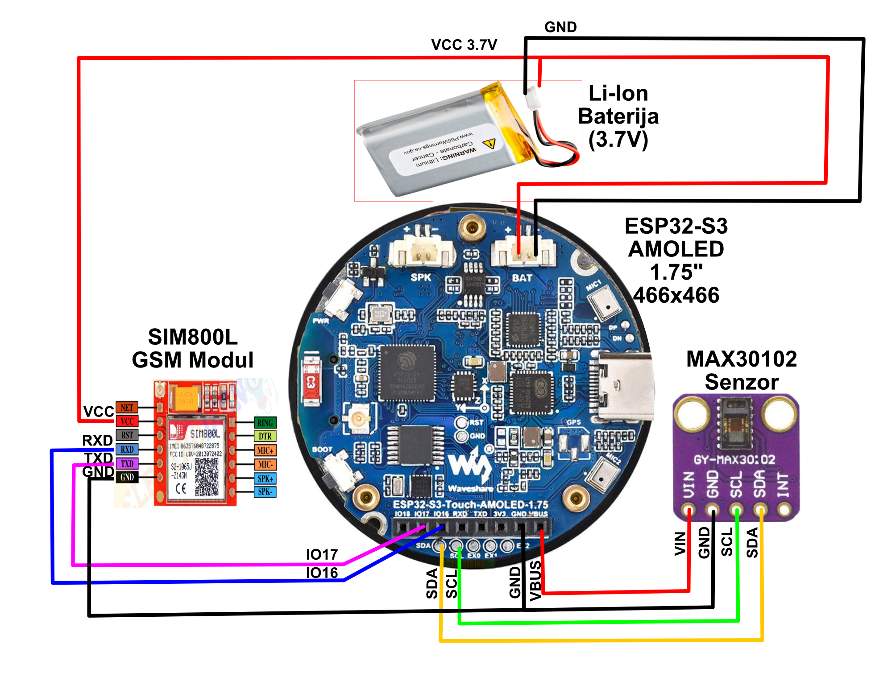

# LifeLink Pametna Narukvica - ESP32-S3

[🇬🇧 English documentation is available in README.md](README.md)

LifeLink je napredna pametna zdravstveno-bezbednosna narukvica izgrađena na **ESP32-S3** platformi. Koristi **ESP-IDF** u kombinaciji sa grafičkom bibliotekom **LVGL** za iscrtavanje prelepog korisničkog interfejsa na okruglom AMOLED ekranu rezolucije 466x466 piksela. Prvenstveno je fokusirana na brigu o najugroženijim pacijentima i starijim licima, praćenje zdravstvenih parametara i brzo reagovanje u hitnim situacijama.

## Glavne Funkcionalnosti

- **Napredna Detekcija Pada**: Koristi QMI8658 IMU (Akcelerometar + Žiroskop) za otkrivanje naglih padova i jakih udaraca o tlo. Zahteva period zadržavanja u nepomičnom stanju i specifičnu promenu ugla nagiba nakon udara kako bi potvrdio pravi pad a izbegao lažne uzbune (prilikom npr. trčanja ili naglih pokreta ruke).
- **Simulacija Pada & Poništavanje**: Korisnici mogu lako testirati sistem simulacijom pada preko samog interfejsa narukvice. Pravi pad okida 5-sekundno odbrojavanje na ekranu; ako je greška ili korisniku nije potrebna pomoć, jednim dodirom po ekranu proces se poništava i prekidaju se hitne akcije.
- **Automatski GSM SMS Alarmi**: Komunicira sa SIM800L GSM Modulom kako bi asinhrono (u pozadini) poslao SMS upozorenja koja sadrže:
  - Precizne GPS koordinate formatirane kao direktan Google Maps link (Lokacija gde se osoba nalazi).
  - Otkucaje srca u sekundi akcidenta.
  - Informaciju da li je pad bio stvaran ili samo test/simulacija.
- **Zdravstveni Parametri Uživo**: Sistem redovno očitava brzinu pulsa i oksigenaciju krvi u procentima (SpO2) uz pomoć MAX30102 senzora na poleđini. Novi podaci se uvek sveže ažuriraju na početnom ekranu.
- **Interaktivni Korisnički Interfejs (LVGL)**: 
  - Dinamična statusna traka na vrhu ekrana sa indikatorima za GPS konekciju, GSM povezanost (sa promenom boje u zavisnosti od signala), status Baterije i Bluetooth Mreže.
  - Navigacija putem prevlačenja prsta po ekranu nalevo i nadesno (Meni gestovi).
  - Zaseban "Podešavanja ekran" sa ugrađenom namenskom uveličanom numeričkom tastaturom koja pojednostavljuje unos ili promenu telefonskog broja hitne službe ili bliskog lica (nije potrebna aplikacija na telefonu).
- **Pregled Senzora (Debug)**: Lako dostupan "DEBUG" prekidač i pogled implementiran pravo u UI sistem koji omogućava programerima uživo posmatranje X, Y, Z , i G sile, korisno zbog finog štelovanja parametara padova.
- **Live Monitor Dashboard**: Centralizovani cloud interfejs za negovatelje koji omogućava praćenje zdravstvenih parametara (Puls, SpO2) sa istorijskim grafikonima i vizuelizacijom normalnog opsega (60-100 BPM / 95-100% SpO2).
- **Mapa sa Dvostrukim Praćenjem**: Integrisana mapa u realnom vremenu koja istovremeno prikazuje GPS lokaciju i narukvice i pratećeg mobilnog telefona.

## Prateća Mobilna Aplikacija (Flutter)

Cross-platform **Flutter** prateća aplikacija proširuje mogućnosti LifeLink sistema putem Bluetooth Low Energy (BLE) konekcije:

- **Dashboard Uživo**: Prikaz vitalnih parametara u realnom vremenu — puls (BPM), SpO2, G-sila i GPS lokacija preslikani sa narukvice.
- **BLE Povezivanje**: Automatsko ili manuelno uparivanje sa LifeLink narukvicom putem BLE SPP protokola.
- **Hitni Odgovor**: Konfigurisane akcije pri padu — direktan telefonski **poziv**, **SMS** sa GPS koordinatama ili sistemski **SOS** signal.
- **Ogledalo Detekcije Pada**: Aplikacija preslikava 3-faznu detekciju pada sa narukvice (Bezbedno → Upozorenje → Alarm) sa 5-sekundnim odbrojavanjem i haptičkim/zvučnim alarmom.
- **Podešavanja**: Konfiguracija hitnog kontakta, tipa akcije pada, trajanja odbrojavanja i MAC adrese uređaja (baterija narukvice).
- **Interaktivna Mapa**: Prikaz lokacije korisnika na OpenStreetMap mapi za pomoć spasiocima.

## Hardver

- **Mikrokontroler**: ESP32-S3
- **Displej**: Okrugli AMOLED ekran (466x466)
- **Mreža / Komunikacija**: SIM800L GSM Modul (Komunikacija bazirana na AT Komandama, napajan direktno sa 3.7V Li-Ion baterije)
- **IMU Senzori**: QMI8658 (Praćenje pokreta i nagiba)
- **Senzori Zdravlja**: MAX30102 (Otkucaji srca i SpO2)
- **Power Management (Baterija i Struja)**: AXP2101

## Električna Šema


## Podešavanje i Pokretanje

Ovaj projekat je izgrađen i napisan u jezicima C i C++, preko [Espressif ESP-IDF frejmvorka](https://docs.espressif.com/projects/esp-idf/en/latest/esp32s3/get-started/) (v5.x i vise je preporuka).

### 1. Konfiguracija
Setujte vaš procesor na ESP32-S3 i uđite u meni opcije kako bi uverili konfiguracije:
```bash
idf.py set-target esp32s3
idf.py menuconfig
```
### 2. Građenje arhitekture i Flešovanje
Kompilirajte kod i prebacite softver na mikrokontroler:
```bash
idf.py build
idf.py -p COMX flash monitor
```

 *(COMX podesite na port vašeg esp programatora)*

## Pregled i mapiranje Ekrana

1. **Glavni Skrin (Ekran 1)**: Brojčanik (Narukvica), glavni vitali i najosnovnije konektivne ikonice.
2. **Prikaz Senzora (Ekran 2)**: Test dugme za simulaciju pada bez prave povrede, uz Debug panel parametara žiroskopa za stručno lice.
3. **Podešavanja (Ekran 3)**: Prikaza ogromne numeričke tastature gde prstima svako može uneti pretplatnički broj mobilnog telefona i sačevati podešavanje u obezbeđenu RAM particiju narukvice bez ometanja. 
4. **Ekran u hitnim situacijama (Ekran 4)**: Alarmantan crveni ekran, koji glasnim i krupnim tekstom nudi korisniku obaranje upozorenja ako on stoji i zapravo je dobro. 

## Odstranjivanje grešaka (Troubleshooting)

### Problem sa GSM SIM800L modulom: `+CREG: 1,3` i nasumični `+CPIN: NO SIM` logovi
Ako uređaj ne uspeva da se registruje na mrežu, a serijski monitor u petlji izbacuje `Network not registered yet. CREG status: +CREG: 1,3` (Registration Denied) prećeno sa `+CPIN: NO SIM` ili `+CME ERROR: 256`, problem leži u **nedovoljno snažnom napajanju** modula.
- **Šta se dešava:** Prilikom pokušaja registracije na baznu stanicu GSM (2G) mreže, RF pojačivač unutar SIM800L modula naglo povuče i do **2 ampera** (2A peak current) u kratkom piku (burst). Ukoliko napajanje ne može da isporuči tu količinu čiste struje momentalno, napon pada i dešava se tkz. *"Brownout reset"*.
- **Kako popraviti (Rešenje):**
  1. SIM800L radi na **3.7–4.2V** i napaja se direktno sa Li-Ion baterije — nije potreban boost konvertor.
  2. Zalemiti **1000µF 10V elektrolitski kondenzator** i **100nF keramički kondenzator** paralelno, direktno na VCC i GND pinove SIM800L modula. Elektrolitski apsorbuje 2A strujne pikove, keramički filtrira visokofrekventne smetnje.
  3. Koristite deblje (manjeg otpora) napojne kablove između baterije i SIM800L modula.
  4. Uverite se da SIM kartica nije 4G-only u mreži vašeg operatera i da nema aktivan PIN kod.
  5. Softver sadrži automatski recovery mehanizam — nakon 3 uzastopna neuspeha, GSM modul se automatski restartuje.
